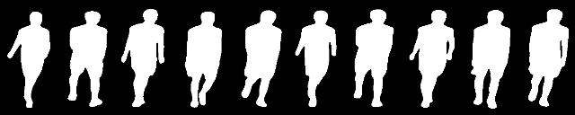
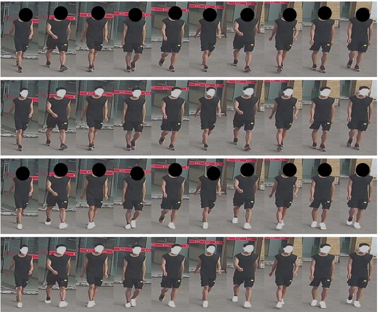

# The CCPG Benchmark

A Cloth-Changing Benchmark for Person re-identification and Gait recognition (CCPG).

## Highlights in CCPG

(1) It provides 200 identities and over 16K sequences are captured indoors and outdoors.

(2) Each identity has seven different cloth-changing statuses, which is never seen in previous datasets.

(3) RGB and silhouettes version data are both available for research purposes **ONLY**.

## Examples of CCPG

#### Silhoutte

#### RGB

#### Clothes Variation

## Download CCPG
All users can obtain and use this dataset and its subsets only after finishing the following steps.
  1. Send us a request for the latest agreement by [email](BNU-IVC@outlook.com).
  2. Submit the completed agreement to the same email address as above.
  
We will process your requests soon. If you have any problem, please contact us. 

## Citation
Please cite the following paper if you find this useful in your research:

@inproceedings{ccgp2023, 
  title={An In-depth Exploration of Person Re-identification and Gait Recognition in Cloth-Changing Conditions}, 
  author={Weijia Li, Saihui Hou, Chunjie Zhang, Chunshui Cao, Xu Liu, Yongzhen Huang, Yao Zhao}, 
  booktitle={Proceedings of the IEEE/CVF conference on computer vision and pattern recognition}, 
  year={2023} 
}

**Note:**
This dataset is only used for **ACADEMIC PURPOSES**, anyone can not use this code for anything that might be considered commercial use.

