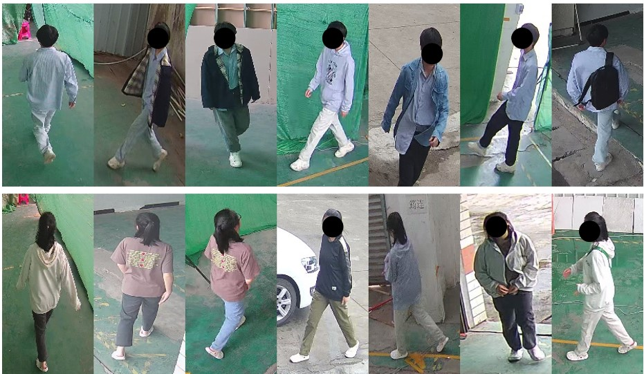

# The CCPG Benchmark

A Cloth-Changing Benchmark for Person Re-identification and Gait Recognition (CCPG).

## Highlights in CCPG

(1) It provides 200 identities, including over 16K sequences captured both indoors and outdoors.

(2) Each identity has seven different cloth-changing statuses, which is a feature not previously seen in other datasets.

(3) The dataset includes **RGB**, **silhouette**, and **pose** data versions, but it is essential to note that it is **ACADEMIC USE ONLY**. 

## Examples of CCPG

#### Silhouette


#### RGB


#### Clothes Variation


## Download CCPG
To obtain and use this dataset and its subsets, all users are required to complete the following steps:
  1. Download the latest agreement and complete it.
  2. Submit it to BNU-IVC@outlook.com .
  3. Please use the organization's email address to send the mail.
  
We will handle your requests within a week. (**Occasionally, emails may be flagged as spam. If you haven't received a response within a week, please resend your mail from an alternate email address.**)In case you encounter any issues, please feel free to reach out to us via BNU-IVC@outlook.com. <br>

## Recommended Code
CCPG dataset is supported by the popular gait recognition project **[OpenGait](https://github.com/ShiqiYu/OpenGait/)**. We strongly suggest considering the code available at *[here](https://github.com/ShiqiYu/OpenGait/blob/master/datasets/CCPG/README.md)* as the sample code.


## Citation
Please cite the following paper if you find this useful in your research:


```BibTeX
@InProceedings{Li_2023_CVPR,
    author    = {Li, Weijia and Hou, Saihui and Zhang, Chunjie and Cao, Chunshui and Liu, Xu and Huang, Yongzhen and Zhao, Yao},
    title     = {An In-Depth Exploration of Person Re-Identification and Gait Recognition in Cloth-Changing Conditions},
    booktitle = {Proceedings of the IEEE/CVF Conference on Computer Vision and Pattern Recognition (CVPR)},
    month     = {June},
    year      = {2023},
    pages     = {13824-13833}
}
```


**Note:**
This dataset is only used for **ACADEMIC PURPOSES**, anyone can not use this dataset for anything that might be considered commercial use.


